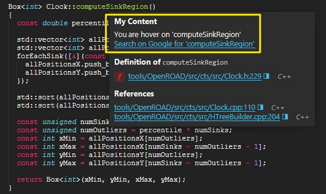

# Sublime Text Popup Extended
Extends the SLT's default pop-up for adding our content without override by a new one.

### Usage

Get [sublime_text_popup_extended](https://github.com/vic4key/sublime_text_popup_extended.git) as a sub-module in your plugin's folder, and use the following sample codes
```python
from .sublime_text_popup_extended import *

def my_popup_content(view, point) -> list:
    result = []
    word = view.substr(view.word(point))
    result.append("You are hover on '%s'" % word)
    result.append("<a href=\"http://www.google.com/search?q=%s\">Search on Google for '%s'</a>" % (word, word))
    return result

def my_on_navigate(href) -> None:
    print("href = '%s'" % href)

def plugin_loaded():
    sublime_text_popup_extended.setup(
        heading_text="My Content",
        fn_popup_content=my_popup_content,
        fn_on_navigate=my_on_navigate)
```

### Screenshots



### Contact
Feel free to contact via [Twitter](https://twitter.com/vic4key) / [Gmail](mailto:vic4key@gmail.com) / [Blog](https://blog.vic.onl/) / [Website](https://vic.onl/)
